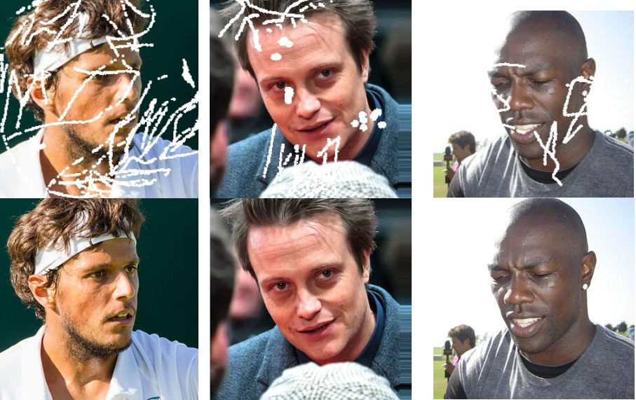
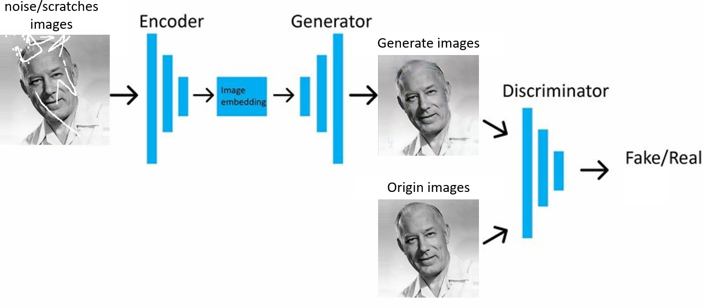
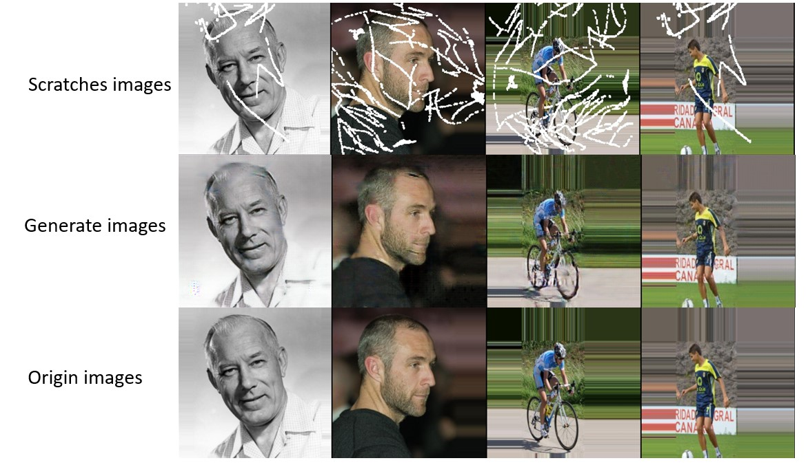

# Image-Restoration-Using-Pix2Pix-GAN
Some images may damaged over time or due to poor storage conditions. In this project, I implement the Pix2Pix model using PyTorch to restore damaged images. The dataset I use is the HumanFace8000 dataset from Kaggle, This dataset is curated automatically through the use of filter to make noise/scratches in the image using a function and also used a overlay image to map those scratches.I also used Aladdin Persson's YouTube tutorial as reference to implement the Pix2Pix model to repair the image.  
# Dataset
for the training and testing. I used a dataset openly available on Kaggle. Each folder contains scratches/noise and original images in the ratio of 50:50. Each folder in the training data contains nearly 8000 images . For the training of GAN for image restoration, i needed a dataset in which i could use both noise and origin images in parallel. So, first, I saved all the image names in a python list for both folders, then I made a separate list for the image names that were common in both lists and arranged them in the same manner. So, now I can use both scratches/noise and original images in parallel by calling both lists together.

  

  
# Model and Training
As mentioned earlier, this project utilizes the Pix2Pix GAN model. Pix2Pix consists of two main components: a generator and a discriminator. In Pix2Pix GAN,The generator is based on the U-Net architecture, which uses an encoder-decoder structure with skip connections to retain spatial information, making it effective for image to image translation tasks. The discriminator employs PatchGAN, which classifies image patches rather than the entire image, allowing it to focus on local texture details.  

  

  
For training, I used a mini-batch approach with a batch size of 8. The Adam optimizer is applied to both the generator and discriminator, with a learning rate of 0.0002 and momentum parameters β1 = 0.5 and β2 = 0.999. The loss functions used include Binary Cross Entropy with Logits (BCE) for adversarial loss and L1 Loss for reconstruction accuracy. The input images have three channels (RGB) with a resolution of 256×256. The model was trained for 50 epochs.
# Evaluation
The model demonstrates its capability in restoring damaged images using the Pix2Pix GAN framework. However, certain limitations remain. When resizing the generated images back to their original dimensions, some details are inevitably lost. In cases where the damage is extensive, the restored areas may appear distorted, and even undamaged regions might be altered due to misinterpretation by the model. Additionally, when zooming in, faint grid-like artifacts can be observed, corresponding to the patch sizes used in PatchGAN.
  

  

  
Despite these challenges, the model performs well in reconstructing moderately damaged images, preserving key features, and generating visually plausible results. Future improvements could involve refining the architecture, using higher-resolution inputs, or incorporating additional loss functions to enhance the realism and accuracy of the restored images.
